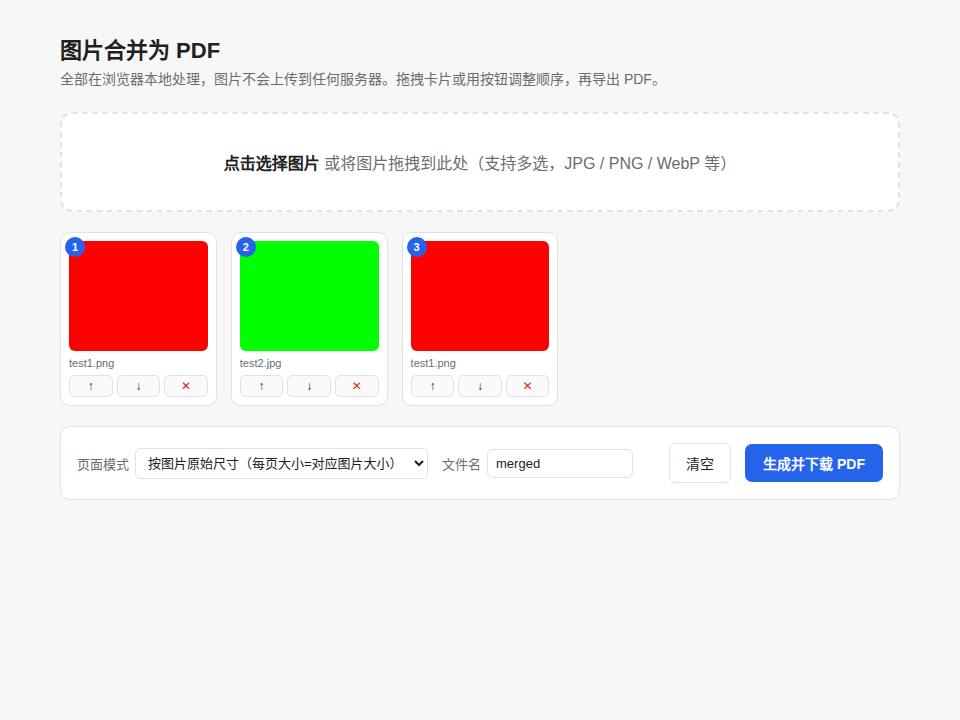

<div align="center">


# img-merge

**纯前端、零依赖部署的图片合并 PDF 小工具 / A pure client-side, zero-backend image-to-PDF merger**


**[🚀 在线体验 / Live Demo](https://yongxin-ms.github.io/img-merge/)**

[功能](#-特性--features) ·
[快速开始](#-快速开始--quick-start) ·
[部署](#-部署--deployment) ·
[原理](#-工作原理--how-it-works) ·
[License](#-license)

</div>

---

把多张图片拖进浏览器，调整好顺序，一键导出合并好的 PDF —— 全程在浏览器本地完成，图片不会上传到任何服务器，也不需要安装任何软件或运行任何后端服务。

Drag multiple images into your browser, reorder them, and export a merged PDF — entirely client-side. No image ever leaves your machine, and there is no backend, database, or install step required.

<div align="center">

</div>

## ✨ 特性 / Features

- 🖼️ **点击或拖拽添加图片**，支持 JPG / PNG / WebP / PDF 等常见格式，可一次多选
  Click or drag-and-drop to add images — JPG, PNG, WebP, PDF and more, multi-select supported
- 🔀 **两种排序方式**：直接拖拽卡片，或用 ↑ / ↓ 按钮精确移动
  Reorder two ways: drag the cards directly, or use the ↑ / ↓ buttons for precise control
- 🗑️ **单独移除**任意一张图片，无需重新上传
  Remove any single image without re-uploading the rest
- 📄 **两种页面模式**：按每张图片的原始尺寸单独出页，或统一缩放为 A4 居中
  Two page modes: page-per-image at native resolution, or scaled and centered on A4
- 🔒 **100% 本地处理**，没有网络请求、没有上传、没有追踪
  100% local processing — no network requests, no uploads, no tracking
- 📦 **单文件部署**，一个 `index.html` 搞定，可以直接双击打开，也可以扔进任意静态服务器
  Ships as a single self-contained `index.html` — double-click to run locally, or drop it on any static file server

## 🚀 快速开始 / Quick Start

### 本地直接用 / Run locally

不需要安装任何东西，下载 `index.html` 双击（或拖进浏览器）即可使用。

No install required — download `index.html` and open it directly in any modern browser.

```bash
git clone https://github.com/yongxin-ms/img-merge.git
cd img-merge
open index.html   # macOS
# 或者 Windows 下双击 index.html / Windows: double-click index.html
```

### 用法 / Usage

1. 点击上传区域选择图片，或直接把图片拖进来 / Click the drop zone or drag images in
2. 拖拽卡片或点击 ↑ / ↓ 调整顺序 / Drag cards or use ↑ / ↓ to reorder
3. 选择页面模式（原始尺寸 / A4）/ Pick a page mode (native size / A4)
4. 点击「生成并下载 PDF」/ Click "Generate & Download PDF"

## 🌐 部署 / Deployment

因为 `index.html` 是纯静态文件，任何能托管静态资源的方式都能用，这里给一个 nginx 的例子。

Since `index.html` is fully static, any static hosting method works. Here's an nginx example:

```nginx
server {
    listen 80;
    server_name img-merge.yourdomain.com;

    root /var/www/img-merge;
    index index.html;

    location / {
        try_files $uri $uri/ =404;
    }
}
```

或者用 Docker 一行起一个 nginx 容器 / or spin up nginx with Docker in one line:

```bash
docker run -d \
  --name img-merge \
  -p 8081:80 \
  -v $(pwd):/usr/share/nginx/html:ro \
  nginx:alpine
```

也同样适合 GitHub Pages、Netlify、Vercel、S3 + CloudFront 等任意静态托管平台。

It also works out of the box on GitHub Pages, Netlify, Vercel, S3 + CloudFront, or any other static host.

## ⚙️ 工作原理 / How it Works

所有逻辑都在浏览器里用原生 JavaScript 完成：用 `FileReader` 读取图片、`` 获取尺寸、[jsPDF](https://github.com/parallax/jsPDF)（已内嵌打包进 `index.html`，无需单独引入或联网加载）把图片按顺序写入 PDF 页面，最后触发浏览器下载。没有服务器端代码，也没有任何构建步骤。

Everything runs client-side in vanilla JavaScript: `FileReader` reads each image, an `` element measures its dimensions, and [jsPDF](https://github.com/parallax/jsPDF) (bundled directly inside `index.html`, so no external request or build step is needed) writes each image onto a PDF page in order before triggering a browser download. There is no server-side code and nothing to build.

## 📁 项目结构 / Project Structure

```
img-merge/
├── index.html        # 唯一需要的文件，自包含全部代码和依赖 / the only file you need — fully self-contained
├── docs/
│   ├── icon.png       # 512x512 应用图标 / app icon
│   └── screenshot.png # 界面截图 / UI screenshot
├── README.md
└── LICENSE
```

## 🗺️ 后续想法 / Ideas for Contributions

欢迎 PR，一些可能有意思的方向：

Contributions welcome — some ideas worth exploring:

- 图片压缩 / 质量选项，减小生成的 PDF 体积 / Image compression / quality options to shrink output size
- 支持 PDF 页面之间插入空白页或分隔符 / Support inserting blank/separator pages
- PWA 离线安装支持 / PWA support for offline installation

## 🤝 贡献 / Contributing

欢迎提 Issue 或 PR。这是一个单文件项目，改动 `index.html` 后请确保：加图片、拖拽/按钮排序、两种模式生成 PDF 这几个核心流程都手动测试过。

Issues and PRs are welcome. Since this is a single-file project, please manually verify the core flows after editing `index.html`: adding images, reordering (both drag and buttons), and generating a PDF in both page modes.

## 📜 License

[MIT](LICENSE) — 你可以自由使用、修改、分发，包括商业用途。

[MIT](LICENSE) — free to use, modify, and distribute, including commercially.

## 🙏 致谢 / Acknowledgments

- [jsPDF](https://github.com/parallax/jsPDF) — 提供了浏览器端生成 PDF 的核心能力 / powers the in-browser PDF generation
